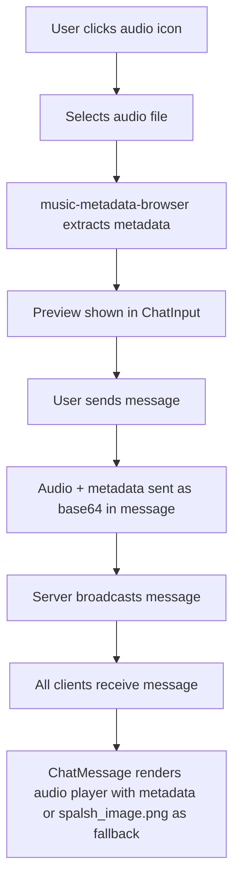

# Audio File Sharing & Player Feature Integration Plan

## Objective
Enable users to upload and share audio files in the chat. Audio messages will display in the chat window with a modern, attractive audio player that shows cover art, title, artist, and provides playback and download controls.

---

## 1. Review of Current Codebase

- **ChatInput.tsx**: Handles image uploads via file input (accept="image/*"), preview, and sending as base64.
- **Chatroom.tsx**: Converts images to base64 (with resizing for non-GIFs), then emits messages via socket.
- **ChatMessage.tsx**: Renders messages, displaying images with `` tags.
- **Message Model**: Supports content, image, avatar, etc. No current support for audio files or audio metadata.

---

## 2. Updated Message Schema

Add optional fields for audio and metadata, ensuring backward compatibility:

```typescript
interface Message {
  id: string,
  username: string,
  content: string,
  timestamp: Date,
  avatar?: string,
  image?: string,
  audio?: string, // base64 or Blob URL
  audioMeta?: {
    title?: string,
    artist?: string,
    album?: string,
    coverUrl?: string
  }
}
```

---

## 3. UI/UX Plan

- **Audio Upload Icon**: Add an audio file icon next to the image and emoji icons in ChatInput.
- **File Selection**: Clicking the icon opens a file picker (`accept="audio/*,audio/mp3,..."`).
- **Preview**: Show audio preview in input before sending, including extracted cover art, title, artist, album.
- **Error States**: Display clear errors for unsupported types, size limits, or extraction failures.
- **Upload Progress**: Optionally show progress for large files.
- **Accessibility**: Ensure all controls are labeled and keyboard accessible.
- **Responsive Design**: Layout adapts for mobile and desktop.
- **Dark Mode**: All audio upload and playback UI must fully support dark mode, matching the rest of the app.

---

## 4. Integration of Libraries

- **music-metadata-browser**: Extracts title, artist, album, and cover art from audio files in the browser, on file select.
- **react-h5-audio-player**: Renders a modern audio player in chat messages, supports all standard controls and is customizable.

---

## 5. Chat Message Rendering

- If `message.audio` is present:
  - Render `react-h5-audio-player` with audio source.
  - Display cover art, title, artist, album above/below player.
  - **Cover Art Fallback**: If no cover art is found in the audio metadata, use `/public/spalsh_image.png` as the fallback image.
  - Add download button (links to base64 or Blob URL).
  - Fallback to `<audio controls>` if player fails.
  - Ensure accessibility (labels, keyboard controls).
  - All UI elements must be styled for dark mode.

---

## 6. Error Handling & Validation

- Accept only audio file types (`audio/*`).
- Enforce file size limit (e.g., 10MB).
- Show user-friendly errors for unsupported formats, extraction failures, or playback issues.
- Graceful fallback if metadata extraction or audio playback fails.

---

## 7. Frontend Component Updates

- **ChatInput.tsx**:
  - Add audio upload button and file input.
  - Handle audio file selection, validate, extract metadata, preview.
  - Store audio file and metadata in state for preview.
  - On send, pass audio and metadata to `onSendMessage`.
- **Chatroom.tsx**:
  - Update message sending logic to handle audio files and metadata.
  - Ensure audio is sent as base64 or Blob URL in the message.
- **ChatMessage.tsx**:
  - Render audio player and metadata if audio is present.
  - Use `/public/spalsh_image.png` as fallback cover art if none is found.
  - Maintain backward compatibility for text and image messages.
  - Ensure all new UI is styled for dark mode.

---

## 8. Backend Considerations

- No backend changes needed if audio is sent as base64 in the message (like images).
- For large files or future scalability, consider server-side storage, Blob URLs, or chunked uploads.
- Enforce security and validation if backend processing is added.

---

## 9. Audio Upload & Playback Flow (Mermaid Diagram)



---

## 10. Implementation Steps & Testing Strategy

### Implementation Steps
1. Update message schema to include audio and audioMeta fields.
2. Add audio upload button and file input to ChatInput.
3. Integrate music-metadata-browser for metadata extraction on file select.
4. Implement audio preview UI in ChatInput.
5. Update message sending logic in Chatroom to handle audio.
6. Update ChatMessage to render audio player and metadata, using `/public/spalsh_image.png` as fallback cover art.
7. Add error handling and validation for audio uploads.
8. Ensure all new UI supports dark mode.
9. Test for regressions in image/text messaging.

### Testing Strategy
- **Unit Tests**: For utility functions (e.g., metadata extraction, file validation).
- **Integration Tests**: For message sending/receiving with audio.
- **Manual UI Testing**: On desktop and mobile, covering:
  - Audio upload, preview, send, playback, download.
  - Error states (invalid file, large file, extraction failure).
  - Accessibility (keyboard navigation, screen reader labels).
  - Dark mode appearance and fallback image.
- **Regression Testing**: Ensure existing chat/image features are unaffected.

---

## 11. Future Enhancements

- Server-side storage for large audio files.
- Waveform visualization.
- Audio message reactions.
- Drag-and-drop upload.
- Audio recording in browser.

---

## References

- react-h5-audio-player
- music-metadata-browser
- MDN: Using files from web applications
