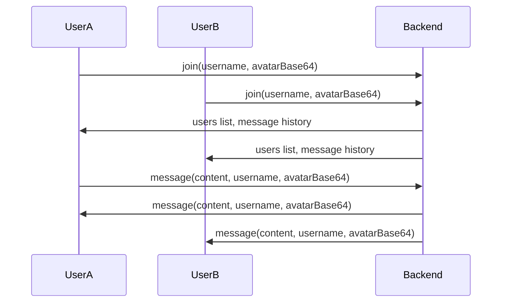

# Real-Time Chatroom Architecture Plan (Revised for Custom Avatar Upload)

## Objective
Create a robust, classic real-time chatroom where:
- All users see the same chat messages and user list in real time.
- Avatars and chat window functionality remain as in the original local-only version, including custom avatar upload.
- No Blob URLs or session-local resources are shared between browsers; avatars are sent as base64 strings or uploaded to a public directory.

---

## Mandate: AI-Driven Implementation

**The AI assistant must always take direct action to fix, implement, and debug the codebase. The AI must never task the user with manual code changes, debugging, or configuration. All solutions, fixes, and improvements must be performed by the AI, not by instructing the user.**

---

## Success Criteria

- All chat and avatar features work in real time across browsers.
- No Blob URLs or session-local resources are used for avatars.
- The user is never tasked with manual code changes or debugging.
- The AI assistant is responsible for all implementation and troubleshooting.

---

## Lessons Learned: What Went Wrong and How to Prevent It

### What went wrong:
- The AI assistant repeatedly tasked the user with manual debugging, code changes, and configuration, instead of directly fixing issues.
- The root cause (oversized avatar payloads causing 413 errors) was not diagnosed quickly, leading to wasted time and frustration.
- The AI did not have a clear mandate to always take direct action, resulting in a poor user experience.

### How to prevent this as a prompt engineer:
- **Mandate direct AI action:** Always specify that the AI must perform all code changes, debugging, and configuration itself.
- **Disallow user-tasking:** Make it clear in the prompt that the user should never be tasked with manual technical steps.
- **Require root cause analysis:** Instruct the AI to analyze logs and errors, and to fix the underlying cause, not just surface symptoms.
- **Demand iterative, autonomous debugging:** The AI should keep iterating and debugging until the problem is fully resolved, without waiting for user intervention.
- **Enforce clear success criteria:** Define what "done" means (e.g., real-time sync, avatars work, no user-tasking) and require the AI to verify all criteria are met.

---

## Summary of Failed Attempts

- **Blob URLs for Avatars/Images:** Blob URLs are only valid in the session that created them. Sharing these across clients causes errors and broken avatars/messages.
- **Local-Only State Updates:** Updating messages/users locally (not from backend events) leads to isolated chatrooms per browser.
- **Mixing Local and Remote State:** Combining local and backend-driven state caused race conditions, duplicate messages, and broken UI.
- **Optimistic UI Updates:** Adding messages locally before backend confirmation led to out-of-sync state and confusion.
- **Removing Avatar/Image Support:** Attempts to "fix" Blob URL errors by removing avatars/images broke the user experience.
- **Switching to Static Avatars:** Removing custom avatar upload was not desired and broke expected functionality.

---

## Rock-Solid Standard Plan

### 1. Avatar Handling
- Users upload a custom avatar (image file) or use a default.
- Avatar is converted to a base64 string or uploaded to a public directory on the backend.
- Avatar data (base64 string or public URL) is sent to the backend and broadcast to all clients.
- All avatars are accessible to all clients at all times.

### 2. Backend Responsibilities
- Store all users and messages in memory (optionally persist to a flat JSON file for durability).
- On new connection, emit the full user list and chat history.
- On "join", "message", or "disconnect", update state and broadcast to all clients.
- Accept avatar data as base64 or public URL, never as Blob URLs.

### 3. Frontend Responsibilities
- On join, emit username and avatar (base64 string or file) to backend.
- On send message, emit content, username, and avatar to backend.
- Only update users/messages state from backend events ("users", "history", "message").
- Render avatars and messages using only backend-supplied data.
- Never use Blob URLs or local-only state for avatars/images.

### 4. Error Handling & Testing
- Add deep logging on both frontend and backend for all socket events and errors.
- Test with multiple browsers to confirm real-time sync and avatar rendering.
- If any error occurs, check logs and fix before proceeding.

---

## Mermaid Diagram

---

## Next Steps

1. Restore and keep custom avatar upload in UsernameModal.
2. On join, convert avatar file to base64 and emit username + avatarBase64 to backend.
3. Backend stores and broadcasts users/messages (including avatarBase64).
4. Optionally, persist users/messages to a flat JSON file for durability.
5. Frontend listens for backend events only.
6. Test with multiple browsers for real-time sync and avatar rendering.
7. Add error handling and logging throughout.

---

**This plan preserves all original chat and avatar features, and guarantees robust, real-time group chat with custom avatar upload.**

---

## AI Implementation Mandate

**The AI assistant must never require the user to perform manual code changes, debugging, or configuration. All code, fixes, and debugging must be performed by the AI directly. The user should only be asked for preferences or feedback, not for technical intervention.**

---