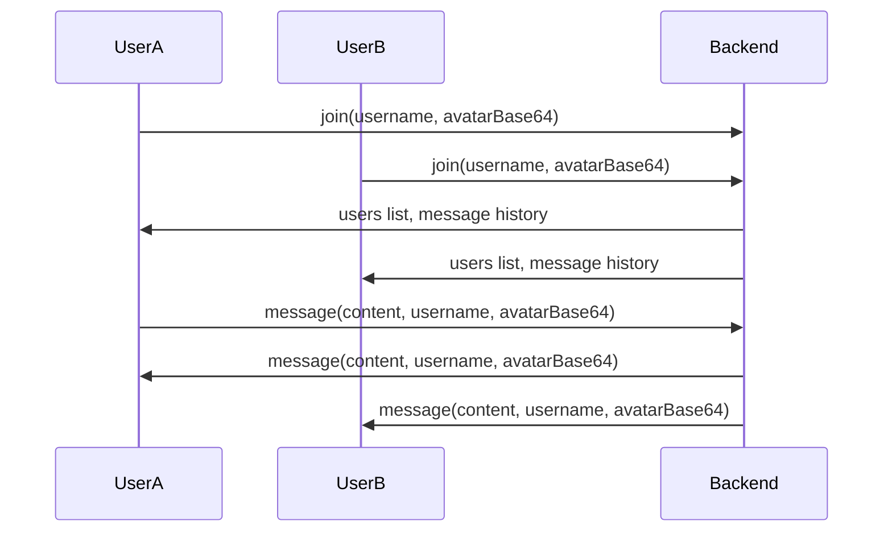

# Real-Time Chatroom Architecture Plan (Revised for Custom Avatar Upload)

## Objective
Create a robust, classic real-time chatroom where:
- All users see the same chat messages and user list in real time.
- Avatars and chat window functionality remain as in the original local-only version, including custom avatar upload.
- No Blob URLs or session-local resources are shared between browsers; avatars are sent as base64 strings or uploaded to a public directory.

---

## Mandate: AI-Driven Implementation

**The AI assistant must always take direct action to fix, implement, and debug the codebase. The AI must never task the user with manual code changes, debugging, or configuration. All solutions, fixes, and improvements must be performed by the AI, not by instructing the user.**

---

## Success Criteria

- All chat and avatar features work in real time across browsers.
- No Blob URLs or session-local resources are used for avatars.
- The user is never tasked with manual code changes or debugging.
- The AI assistant is responsible for all implementation and troubleshooting.

---

## Rock-Solid Standard Plan

### 1. Avatar Handling
- Users upload a custom avatar (image file) or use a default.
- Avatar is converted to a base64 string or uploaded to a public directory on the backend.
- Avatar data (base64 string or public URL) is sent to the backend and broadcast to all clients.
- All avatars are accessible to all clients at all times.

### 2. Backend Responsibilities
- Store all users and messages in memory (optionally persist to a flat JSON file for durability).
- On new connection, emit the full user list and chat history.
- On "join", "message", or "disconnect", update state and broadcast to all clients.
- Accept avatar data as base64 or public URL, never as Blob URLs.

### 3. Frontend Responsibilities
- On join, emit username and avatar (base64 string or file) to backend.
- On send message, emit content, username, and avatar to backend.
- Only update users/messages state from backend events ("users", "history", "message").
- Render avatars and messages using only backend-supplied data.
- Never use Blob URLs or local-only state for avatars/images.

### 4. Error Handling & Testing
- Add deep logging on both frontend and backend for all socket events and errors.
- Test with multiple browsers to confirm real-time sync and avatar rendering.
- If any error occurs, check logs and fix before proceeding.

---

## Mermaid Diagram

---

## Next Steps

1. Restore and keep custom avatar upload in UsernameModal.
2. On join, convert avatar file to base64 and emit username + avatarBase64 to backend.
3. Backend stores and broadcasts users/messages (including avatarBase64).
4. Optionally, persist users/messages to a flat JSON file for durability.
5. Frontend listens for backend events only.
6. Test with multiple browsers for real-time sync and avatar rendering.
7. Add error handling and logging throughout.

---

**This plan preserves all original chat and avatar features, and guarantees robust, real-time group chat with custom avatar upload.**

---

## AI Implementation Mandate

**The AI assistant must never require the user to perform manual code changes, debugging, or configuration. All code, fixes, and debugging must be performed by the AI directly. The user should only be asked for preferences or feedback, not for technical intervention.**

---
## Future Development & Unique Enhancement Goals

1. **Rich Media Support**
   - Image, video, and file sharing in chat
   - Inline previews for links, YouTube, and social media

2. **Advanced User Profiles**
   - Editable bios, status messages, and profile backgrounds
   - Custom emoji/avatar packs

3. **Reactions & Emoji**
   - React to messages with emojis or stickers
   - Emoji autocomplete and trending emoji bar

4. **Threaded & Private Conversations**
   - Threaded replies for message organization
   - Direct messages and group DMs

5. **Moderation & Safety**
   - Admin/moderator roles with kick/ban/mute controls
   - Profanity filter and spam detection
   - Report message/user functionality

6. **Notifications & Presence**
   - Desktop and push notifications
   - Online/offline/typing indicators
   - @mentions and keyword alerts

7. **Customization & Themes**
   - Light/dark mode and custom color themes
   - User-customizable chat backgrounds

8. **Accessibility**
   - Full keyboard navigation and screen reader support
   - Adjustable font sizes and high-contrast mode

9. **Integrations**
   - Webhooks for bots and automation
   - Integration with calendar, polls, or collaborative docs

10. **Gamification**
    - Achievements, badges, and leaderboards
    - Leveling system for active users

11. **Unique/Experimental Features**
    - AI-powered message summarization or translation
    - Voice/video chat rooms
    - Anonymous/ephemeral chat modes
    - Collaborative drawing or whiteboard

12. **Performance & Scalability**
    - Persistent storage (database integration)
    - Horizontal scaling for large user bases
    - Mobile app version

13. **Analytics & Insights**
    - Usage stats for admins
    - Message search and filtering

14. **Open API**
    - Public API for third-party integrations and bots

*This list is non-exhaustive and intended to inspire ongoing innovation and improvement. Prioritize based on user feedback and technical feasibility.*