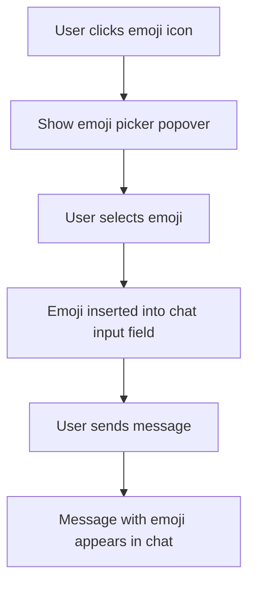

# Real-Time Chatroom Architecture Plan (With Image Upload)

## Objective
Create a robust, classic real-time chatroom where:
- All users see the same chat messages (including images) and user list in real time.
- Users can upload and share images in chat messages.
- Avatars and chat window functionality work seamlessly with image sharing.
- All media is shared efficiently using base64 encoding.

---

## Mandate: AI-Driven Implementation

**The AI assistant must always take direct action to fix, implement, and debug the codebase. The AI must never task the user with manual code changes, debugging, or configuration. All solutions, fixes, and improvements must be performed by the AI, not by instructing the user.**

---

## Success Criteria

- All chat and avatar features work in real time across browsers.
- No Blob URLs or session-local resources are used for avatars.
- The user is never tasked with manual code changes or debugging.
- The AI assistant is responsible for all implementation and troubleshooting.

---

## Implementation Status

### ✅ Completed Features
1. **User Authentication**
   - Username selection
   - Custom avatar upload and display
   - Real-time user list

2. **Messaging**
   - Real-time text chat
   - Message history on connection
   - User disconnection handling

3. **Media Handling**
   - Avatar upload and display using base64
   - Image sharing in chat messages
   - Automatic image resizing (max 800px)
   - 5MB file size limit for uploads

4. **Error Handling**
   - Socket connection error handling
   - Image processing error handling
   - Input validation

## Architecture

### Frontend Components
- **Chatroom.tsx**: Main chat interface and message handling
- **ChatInput.tsx**: Message and image input controls
- **ChatMessage.tsx**: Individual message display
- **UsernameModal.tsx**: User authentication and avatar upload
- **UsersList.tsx**: Online users display

### Emoji Picker Integration

- **Library:** Integrate [`emoji-mart`](https://github.com/missive/emoji-mart) for a robust, customizable emoji picker with TypeScript support.
- **UI/UX:** Add an emoji icon next to the image upload icon in [`ChatInput.tsx`](src/components/ChatInput.tsx:1). Clicking the emoji icon opens a popover with the emoji picker.
- **Interaction:** When an emoji is selected, it is inserted at the current cursor position in the chat input field. Emojis are sent as part of the chat message and rendered in the chat window.
- **Implementation:** Use shadcn-ui popover/dialog for the emoji picker display. Ensure accessibility and mobile compatibility.

### Backend (server.js)
- WebSocket server for real-time communication
- In-memory storage for users and messages
- Event-based communication

### Data Flow
1. Users connect and authenticate
2. Messages and images are sent as base64 strings
3. Server broadcasts to all connected clients
4. Frontend updates in real-time

## Future Enhancements

1. **Rich Media Support**
   - Support for video and file sharing
   - Inline previews for links and media

2. **User Experience**
   - Typing indicators
   - Message read receipts
   - Message reactions

3. **Advanced Features**
   - Private messaging
   - Message search
   - Message editing and deletion

4. **Performance**
   - Virtualized message list for large chat histories
   - Image compression before upload
   - Lazy loading of media

5. **Security**
   - User authentication
   - Message encryption
   - Rate limiting

---

## AI Implementation Mandate

**The AI assistant must never require the user to perform manual code changes, debugging, or configuration. All code, fixes, and debugging must be performed by the AI directly. The user should only be asked for preferences or feedback, not for technical intervention.**

## Future Development Ideas

### Next Up
- [ ] **Message Expiration**: Messages automatically expire after a configurable time period
- [ ] **Clickable Links**: URLs in messages are automatically converted to clickable links that open in a new tab

1. **Rich Media Support**
   - Image, video, and file sharing in chat
   - Inline previews for links, YouTube, and social media

2. **Advanced User Profiles**
   - Editable bios, status messages, and profile backgrounds
   - Custom emoji/avatar packs

3. **Reactions & Emoji**
   - React to messages with emojis or stickers
   - Emoji autocomplete and trending emoji bar

4. **Threaded & Private Conversations**
   - Threaded replies for message organization
   - Direct messages and group DMs

5. **Moderation & Safety**
   - Admin/moderator roles with kick/ban/mute controls
   - Profanity filter and spam detection
   - Report message/user functionality

6. **Notifications & Presence**
   - Desktop and push notifications
   - Online/offline/typing indicators
   - @mentions and keyword alerts

7. **Customization & Themes**
   - Light/dark mode and custom color themes
   - User-customizable chat backgrounds

8. **Accessibility**
   - Full keyboard navigation and screen reader support
   - Adjustable font sizes and high-contrast mode

9. **Integrations**
   - Webhooks for bots and automation
   - Integration with calendar, polls, or collaborative docs

10. **Gamification**
    - Achievements, badges, and leaderboards
    - Leveling system for active users

11. **Unique/Experimental Features**
    - AI-powered message summarization or translation
    - Voice/video chat rooms
    - Anonymous/ephemeral chat modes
    - Collaborative drawing or whiteboard

12. **Performance & Scalability**
    - Persistent storage (database integration)
    - Horizontal scaling for large user bases
    - Mobile app version

13. **Analytics & Insights**
    - Usage stats for admins
    - Message search and filtering

14. **Open API**
    - Public API for third-party integrations and bots

*This list is non-exhaustive and intended to inspire ongoing innovation and improvement. Prioritize based on user feedback and technical feasibility.*